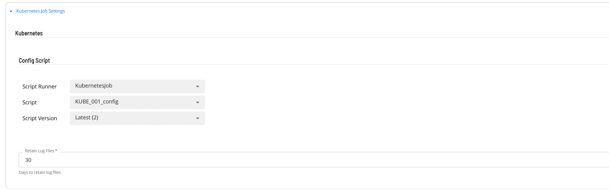

# Define the ACS Kubernetes Connector agent

**Theme:** Configure  
**Who Is It For?** System Administrator, Automation Engineer

## What is it?

Before OpCon can submit jobs to a Kubernetes cluster, you must define two objects in Solution Manager: a KubernetesJob script that holds the cluster connection configuration, and an agent definition that references that script.

- Use this procedure when setting up the connector for the first time in a new OpCon environment
- Use this procedure when connecting to a new Kubernetes cluster that does not yet have a script or agent defined

All definitions are performed in Solution Manager.

## Define KubernetesJob scripts

The connector uses a script to store the `.kube/config` file that defines the Kubernetes cluster connection. You must create a script type, a script runner, and the script itself before defining the agent.

To define the KubernetesJob script type and runner, complete the following steps:

1. In Solution Manager, select **Library**.
2. Select **Scripts**.
3. Select **Script Types** from the upper right corner.
4. Select **+Add**.
5. In the **Name** field, enter `KubernetesJob`.
6. In the **File Extension** field, enter `txt`.
7. In the **Description** field, enter `Used for ACS KubernetesJob Integration`.
8. Select the **Save** button.
9. Select **Script Runners** from the upper right corner.
10. Select **+Add**.
11. In the **Name** field, enter `KubernetesJob`.
12. In the **OS** field, select **KubernetesJob** from the list.
13. In the **Type** field, select **KubernetesJob** from the list.
14. In the **Command** field, enter `cmd.exe /c`.
15. Select the **Save** button.

To create the connector configuration script, complete the following steps:

1. In Solution Manager, select **Library**.
2. Select **Scripts**.
3. Select **Scripts** from the upper right corner.
4. Select **+Add**.
5. In the **Name** field, enter a name for the script. The recommended convention is to append `_config` to the intended agent name.
6. In the **Type** field, select **KubernetesJob** from the list.
7. Assign the required roles.
8. In the **Script** area, paste the full contents of the `.kube/config` file for your cluster.
9. Select the **Save** button.

The following example shows the structure of a `.kube/config` file:

```yaml
apiVersion: v1
clusters:
- cluster:
    certificate-authority-data: 
    *************
    server: https://kubernetes.docker.internal:6443
  name: docker-desktop
contexts:
- context:
    cluster: docker-desktop
    user: docker-desktop
  name: docker-desktop
current-context: docker-desktop
kind: Config
users:
- name: docker-desktop
  user:
    client-certificate-data: 
    *************
    client-key-data: 
    *************
```

## Define the ACS Kubernetes Connector agent

After the script is created, define the agent in Solution Manager.



To define the agent, complete the following steps:

1. In Solution Manager, select **Library**.
2. From the **Administration** menu, select **Agents**.
3. Select **+Add**.
4. In the **Name** field, enter a unique name for the connection.
5. In the **Type** field, select **Kubernetes Job** from the list.
6. Select **General Settings**.
7. Verify that the **NetCom Name** field is set to **Default**, or enter the name of the SMA Relay if a relay is in use.
8. Select **Kubernetes Job Settings**.
9. In the **Config Script** field, select the script that contains the `.kube/config` information.
10. In the **Retain Log files** field, enter the number of days to retain log files.
11. Select the **Save** button.
12. Select **Communication Settings**.
13. Verify that the **Requires XML Escape Sequences: User-Defined** field is set to **True**. If it is not, set it to **True** and select the **Save** button.
14. Select the **Change Communication Status** button and select **Enable Full Comm**. The agent connection is established.

## FAQs

**Where do I get the `.kube/config` file?**  
The `.kube/config` file is provided by your Kubernetes cluster administrator. It contains the cluster endpoint, authentication certificates, and context definitions required to connect to the cluster.

**Can I define multiple agents for different Kubernetes clusters?**  
Yes. Create a separate script and agent definition for each cluster. Each agent uses its own `.kube/config` script to establish an independent cluster connection.

**What does the NetCom Name field control?**  
The **NetCom Name** field determines which OpCon communication channel the agent uses. Use **Default** for standard on-premises deployments. If your environment routes agent communication through a named relay, enter the relay name here.

**Why must XML escape sequences be enabled?**  
Kubernetes job definitions include YAML content that contains characters such as `<`, `>`, and `&` that must be escaped when transmitted through the OpCon communication protocol. Enabling this setting ensures those characters are transmitted correctly.

## Glossary

**NetCom** — The OpCon network communication layer that handles message exchange between the OpCon server and agents.

**.kube/config** — The Kubernetes client configuration file that defines cluster endpoints, user credentials, and context settings. The connector uses this file to authenticate and communicate with the cluster.

**Script Repository** — The OpCon library where reusable scripts are stored and versioned. Scripts can be assigned roles for access control and referenced from agent and job definitions.
