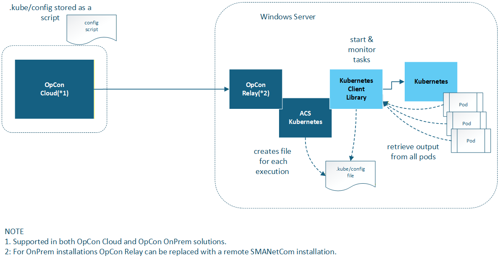

# ACS Kubernetes Connector overview

**Theme:** Overview  
**Who Is It For?** Automation Engineer, System Administrator

## What is it?

The ACS Kubernetes Connector enables OpCon to submit and monitor jobs within a Kubernetes cluster. When OpCon runs a Kubernetes job, the connector requests the Kubernetes environment to spin up a container (pod), run the specified command inside it, and report the results back to OpCon as a standard job log.

- Use this connector when you need to schedule and monitor containerized workloads from OpCon without building custom integration code
- Use this connector when your organization runs batch processing in Kubernetes and requires centralized scheduling through OpCon
- The connector consolidates log output from multiple parallel pods into a single OpCon job log, simplifying monitoring and auditing of distributed workloads

The connector uses the KubernetesClient library to submit job requests, monitor their status, retrieve logs from all containers (pods) upon completion, and clean up the job environment. OpCon receives a single consolidated log regardless of how many pods were involved in the execution.

## How it works

When OpCon starts a Kubernetes job through this connector, the following sequence occurs:

1. OpCon sends the job definition to the ACS Kubernetes Connector via the agent communication channel.
2. The connector uses the KubernetesClient library to submit a Kubernetes Job to the configured cluster.
3. Kubernetes spins up the requested number of pods and runs the specified command and arguments inside each container.
4. The connector monitors all pods until the completion condition is met (based on **Pods to Complete** setting).
5. Upon completion, the connector retrieves the log output from every pod and consolidates them into a single job log.
6. The connector instructs Kubernetes to clean up the job and its pods.
7. OpCon receives the consolidated log and the final job status.

## FAQs

**Can I run multiple pods in parallel?**  
Yes. The **Pods to Complete** field defines how many total pod completions are required, and the **Parallel Executions** field controls how many pods may run simultaneously.

**What happens to the pods after the job finishes?**  
The connector requests Kubernetes to clean up all pods and the job object after execution completes. This cleanup occurs regardless of whether the job succeeded or failed.

**Where is the Kubernetes cluster configuration stored?**  
The `.kube/config` file that defines the cluster connection is stored as a KubernetesJob script in the OpCon Script Repository and referenced from the agent definition. See [Agent definition](./agent-definition.md) for setup instructions.

**Does the connector support on-premises and cloud OpCon deployments?**  
Yes. On-premises customers install the connector into the `\SAM\plugins` directory; cloud customers install it into the `\Relay\plugins` directory. See [Installation](./installation.md) for details.

## Glossary

**ACS (Agent Connector Service)** — The OpCon framework that hosts connector plugins and provides the communication layer between OpCon and external systems.

**KubernetesClient** — The open-source .NET library used by the connector to communicate with the Kubernetes API server.

**Namespace** — A Kubernetes isolation boundary used to separate resources within a cluster. The connector allows you to target a specific namespace when submitting jobs.

**Pod** — The smallest deployable unit in Kubernetes. Each pod runs one container instance of the specified image. The connector can request multiple pods to execute the same job in parallel.

**Resources (requests/limits)** — Kubernetes resource allocation settings that control the minimum CPU/memory a pod is guaranteed (requests) and the maximum it may consume (limits).
