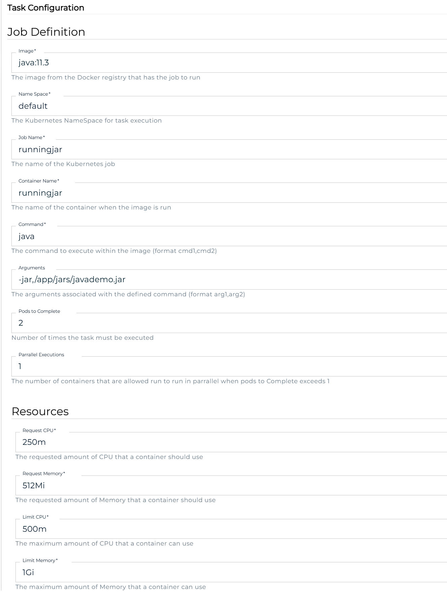

# Task Definition

## Defining tasks

The Kubernetes Job supports the following task types:

Task Type      | Description
---------------|-------------------------------------
Job            | Executes a command within a container in a Kubernetes Cluster.

Defining tasks only requires providing the values associated with the specific task. It is possible to use global properties when defining tasks.

### Job Task

1.  Open Solution Manager.
2.  From the Home page select **Library**
3.  From the ***Administration*** Menu select **Master Jobs**.
4.  Select **+Add** to add a new master job definition.
5.  Fill in the task details.
    - Select the **Schedule** name from the drop-down list.
    - In the **Name** field enter a unique name for the task within the schedule.
    - Select **Kubernetes Job** from the **Job Type** drop-down list.
    - Select **Job** from the **Task Type** drop-down list.

Enter details for Task Type **Job**. 

1.  Select the **Task Details** button.
2.  In the **Integration Selection** section, select the primary integration which is an ACSEase connection previously defined.
3.  In the **Task Configuration** section
    - In the **Image** field enter the image from the Docker Registry that supports the command to be submitted.
    - In the **Name Space** field enter the name space that the task should execute within (default value **default**).
    - In the **Job Name** field enter the name of the Kubernetes job.
    - In the **Container Name** field enter the name of the container when the images run.
    - In the **Command** field enter the command to execute within the container (multiple values can be entered by using a comma (,) as a separator character).
    - In the **Arguments** field enter the arguments to pass to the command (multiple values can be entered by using a comma (,) as a separator character).
    - In the **Pods to Complete** field enter the number of times the task should be executed (default value **1**).
    - In the **Parallel Executions** field enter how many execution can run con-currently (default value **1**).
    - In the **Resources** section enter the **requests** and **limits** associated with the task.
        - In the **Request CPU** field enter the initial CPU requirement (default value **250m**).
        - In the **Request Memory** field enter the initial Memory requirement (default value **512Mi**).
        - In the **Limit CPU** field enter the maximum CPU allowed (default value **500m**).
        - IN the **Limit Memory** field enter the maximun Memeroy allowed (default value **1Gi**).
4.  Save the definition changes. 
